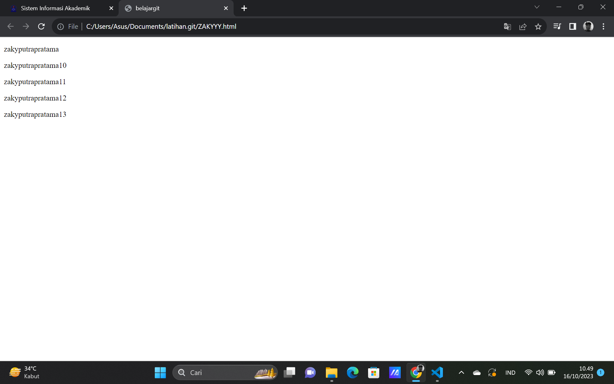

# zakyyy
# latihan git

<h1>LATIHAN GIT</h1>

pertama buat akun github

buat repository

clone repositorynya

tambahkan file README.md

echo “# Latihan 1” >> README.md

git add README.md

git commit -m "deskripsi file"

git push -u origin main

